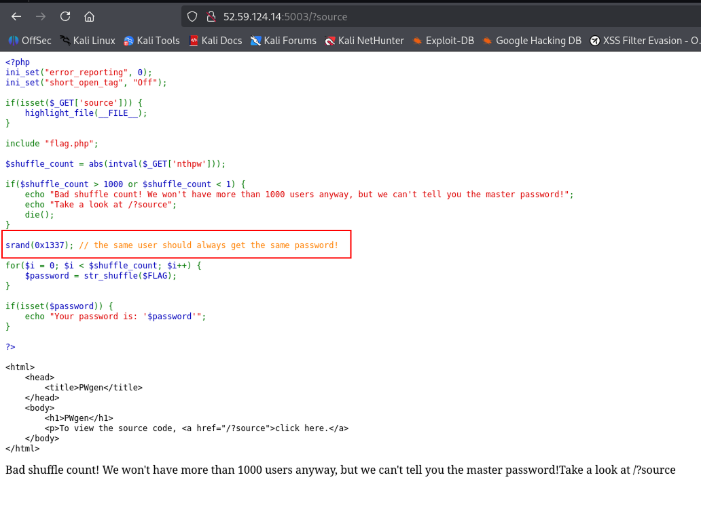

# WhiteDukesDZ - Nullcon CTF 2025 Writeup: Pwgen


---

## Challenge Summary

This challenge presented a simple PHP web application. The goal was to analyze the application for vulnerabilities and exploit them to retrieve the flag.

## Application Analysis

After visiting challenge main page:


We notifce that accessing /?source gives us access to the source code:



After analyzing the source code, we can notice that accessing / with a valid `nthpw` parameter (abs(`nthpw`) <= 1000 || abs(`nthpw`) >= 1), gives us a `password` string. For example `/?nthpw=1`


```data
7F6_23Ha8:5E4N3_/e27833D4S5cNaT_1i_O46STLf3r-4AH6133bdTO5p419U0n53Rdc80F4_Lb6_65BSeWb38f86{dGTf4}eE8__SW4Dp86_4f1VNH8H_C10e7L62154
```

From the source code, we notice tht the real flag is stored in `flag.php` as `$FLAG`. Instead of printing it, the app does `str_shuffle($FLAG)` one or more time (`nthpw`) and shows the last shuffled result.

### Security Observations

- The key detail: `srand(0x1337)` sets a <ins>fixed RNG seed</ins>. This means every time the shuffle runs, it produces the <ins>same permutation</ins> of `$FLAG`.

- `str_shuffle` in PHP is implemented as a `Fisher-Yates shuffle`:

    - It build a list of indices `[0..n-1]`.

    - It swaps elements using `mt_rand(0, i)`

    - With the same seed and the same length, you get the exact same permutation every time.

- That means:

    - If we can rebuild the permutation sequence, we can invert it.

    - Inverting the permutation applied to the shuffled string recovers the original flag.

---

## Solution

To recover the flag, we need to:

    - Seed RNG with `srand(0x1337)`.

    - Build a permutation of indices `[0..n-1]` using the same shuffle process.

    - Invert that permutation: put each character of the shuffled password back to its original position.

We already have the password obtained using `/?nthpw=1`:

```data
7F6_23Ha8:5E4N3_/e27833D4S5cNaT_1i_O46STLf3r-4AH6133bdTO5p419U0n53Rdc80F4_Lb6_65BSeWb38f86{dGTf4}eE8__SW4Dp86_4f1VNH8H_C10e7L62154
```

We automated the recovery process using a PHP script (see `solution/solve.php`)


Serve that `solve.php` in localhost:

```sh
php -S localhost:8000 -t /home/s450r1/Desktop/WhiteDukesDZ/writeups/nullcon-ctf-writeups/web/pwgen/solution
```

Access the page at `http://localhost:8000/solve.php`

If successful, the script will output the flag:

```data
ENO{N3V3r_SHUFFLE_W1TH_STAT1C_S333D_OR_B4D_TH1NGS_WiLL_H4pp3n:-/_0d68ea85d88ba14eb6238776845542cf6fe560936f128404e8c14bd5544636f7} 
```


