# WhiteDukesDZ - Nullcon CTF 2025 Writeup: Webby

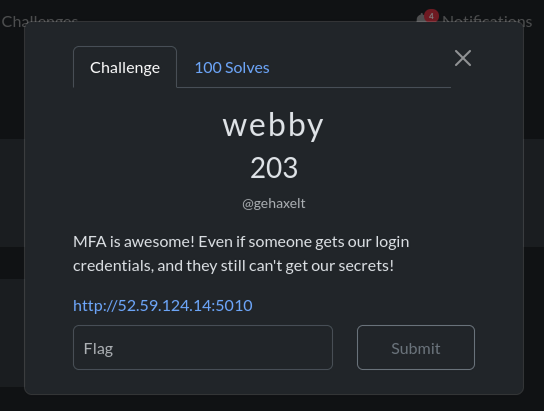

---

## Challenge Summary

This challenge presents a Python web application with a `Multi Factor Authentication (MFA)` system. The app allows users to log in with a username and password, and enforces MFA only for the admin user. After a successful login, if MFA is required, the server generates a random token using a combination of bcrypt and MD5 hashing, and expects the user to submit this token to complete authentication.

## Application Analysis

After visiting challenge main page:

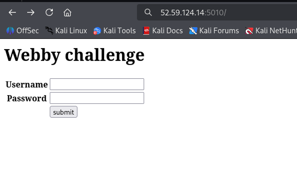

We notice a login page, when that accessing the page source code (`CTRL + U` in your browser):

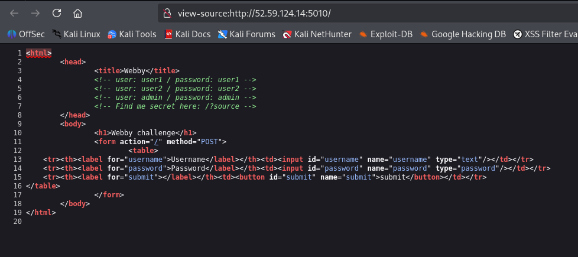

We notice that there is some hardcoded credentials (EX. `admin`:`admin`). Also it is mentioned that we can see the application source code by adding `source` parameter. After visiting `/?source=1` we can get the app code (see `challenge/app.py`). Before analyzing the `app.py` code. We tried to login directly using the hardcoded credentials:

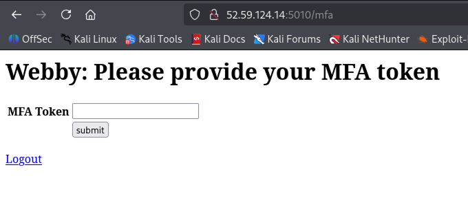

It is mentioned that we need another token (`MFA`) so we can complete our login process.

Going back to the application source code at `challenge/app.py`, there is four main endpoints:

    - `/` it is the main page, it accepts both `GET` and `POST`.

        - if `GET`, reads input parameters using `web.input()`. If input contains `source`, it returns the content of the current file `app.py`. Otherwise it creates the login form and renders it.

        - if `POST`: 
            
            - Creates a login form and checks if submitted data is valid, if not it kills the session and re-renders the login page.

            - Reads the submitted `username` and `password`. if incorrect, it kills the session and re-renders the login page. Otherwise, it marks the session as logged in and saves the `username`. If the user requires `MFA` (only `admin`), it:

                - Sets a session flag for MFA.

                - Generates a random MFA token using bcrypt and MD5, stores it in the session.

                - Marks the session as not logged in and redirects to the MFA page.

            If MFA is not required, it renders the main page for the user.

    - `/mfa` handles the Multi Factor Authentication step, accepting both `GET` and `POST`.

        - if `GET`, checks if the session flag for MFA `doMFA` is set. If not, redirects to the main page. Otherwise, it creates and renders the MFA token form.

        - if `POST`:

            - Creates the MFA form and checks if submitted data is valid. If not, re-renders the MFA form.

            - Reads the submitted token. If the token does not match the one stored in the session `tokenMFA`, redirects to the logout page.

            - If the token matches, marks the session as logged in and redirects to the `/flag` page.

    - `/logout`, `GET` only, it kills the session and redirect to login page.

    - `/flag` , `GET` only, it checks from session if the user is logged in and its `username = admin`. If not it redirects to the main page. Otherwise it kills the session and shows the flag.


### Security Observations

- When logging in, after the credentials check, the session is set to `session.loggedIn=True` before the `check_mfa` step. This means that even for users who require `MFA` (like `admin`), the session is briefly marked as logged in before `check_mfa` resets `session.loggedIn` to `False`. Because generating the MFA token (`session.tokenMFA = hashlib.md5(bcrypt.hashpw(str(secrets.randbits(random.randint(40,65))).encode(),bcrypt.gensalt(14))).hexdigest()`) can take a short amount of time, this creates a window for a <ins>race condition</ins> exploit: an attacker could potentially access endpoints that require `loggedIn=True` during this brief period, bypassing MFA.

---

## Solution

To get the flag, we need to:

    - Log in using the `admin` credentials.

    - Exploit the brief window between `session.loggedIn=True` and `session.loggedIn=False` (while the MFA token is being generated) to access `/flag` and read the flag before the session is reset.

To reliably perform this race condition attack, we use `Burp Suite Community Edition` to send the login and flag requests in rapid succession over the same connection:

- Open `Burp Suite Community Edition` and use the built-in browser to access the challenge instance.

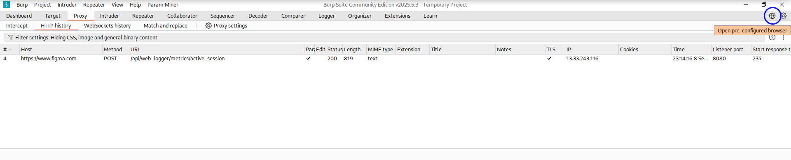

- Log in with the `admin:admin` credentials.

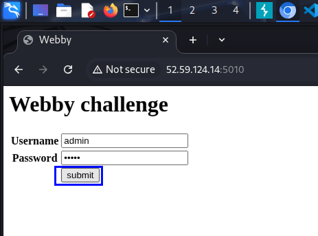

- Attempt to access `/flag` (you'll be redirected to the login page), just to capture the flag request in Burp's history.

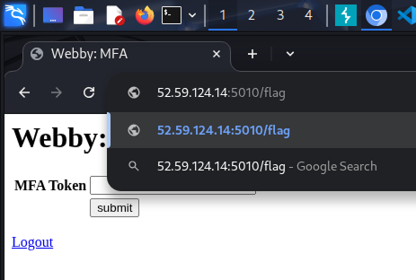

- In Burp, go to `Proxy` > `HTTP History`. You should see both the login and flag requests.

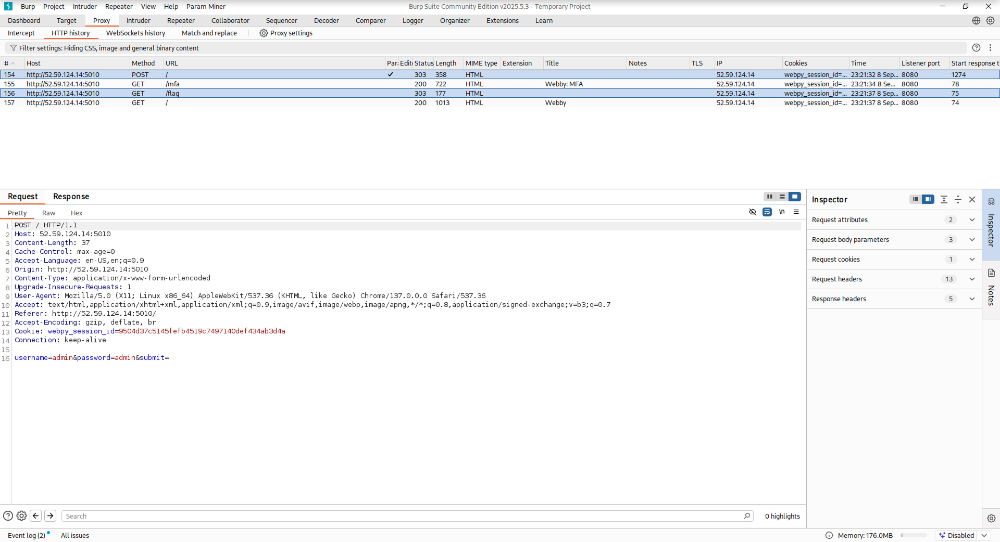

- For each request, right-click and select `Send to repeater`. Then switch to the `Repeater` tab.

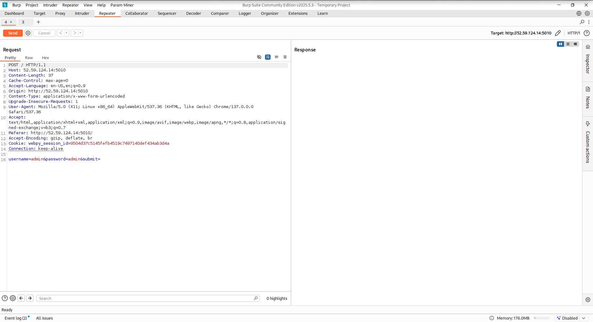

- Ensure the login request tab is before the flag request tab. Group both tabs: right-click a tab, select `Add tab to group` > `Create tab group`, select both tabs, and submit.

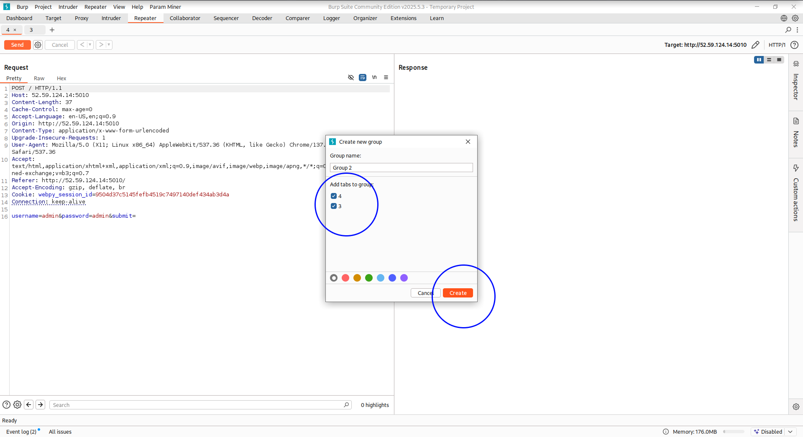

- Click the arrow next to `Send`, then choose `Send group in sequence (single connection)` and click `Send group`.

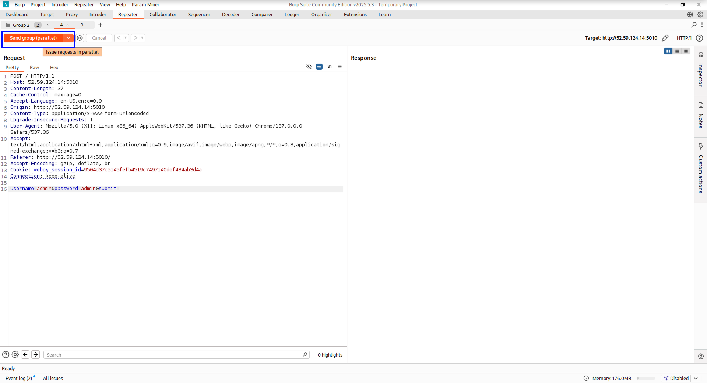

If successful, the flag will be returned:

```data
ENO{R4Ces_Ar3_3ver1Wher3_Y3ah!!}
```


